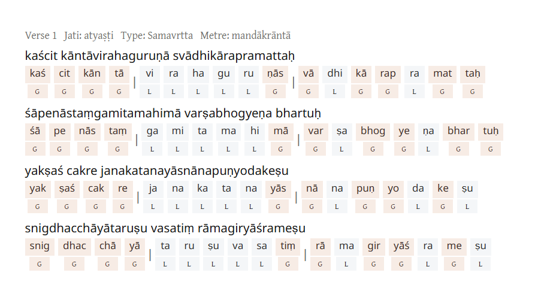

## Introduction

सा विद्या नौस्तिरीषुणां गम्भीरं काव्यसागरम् — दण्डिनः

A sizeable part of Sanskrit literature, and probably the majority of the works most learners will ever read, is written in verse.
Basic knowledge of Sanskrit metres is directly related to the enjoyment and appreciation of that literature, and it is essential
for criticism and literary study.

This site collects resources related to Sanskrit metres: metre identification, scansion tools, examples, and a starter guide
for writing metrical Sanskrit.

**Note**: The following introduction focuses on **varṇavṛtta** (metres regulated by syllable count and quantity).
Mātrāvṛtta (moraic metres) and Vedic metres are separate traditions and are not covered here.

## Syllables and Syllabification

In Sanskrit, vowels can be long (ā ī ū ṝ e ai o au) or short (a i u ṛ ḷ).
Diphthongs (ai, e, o, au) are always long. Syllables are either heavy (guru) or light (laghu).
A practical rule is:

```A syllable is light if it has a short vowel and is open. All other syllables are heavy.```

More precisely:

1. Syllables with only short vowels are light (e.g., *ka, ku, ki*). Syllables with long vowels are heavy (e.g., *kā, kī, kū, kai*).
2. A syllable with a short vowel that is **closed** is heavy. For example, *kathā* → `ka.thā` (ka is open, so light).
   *karma* → `kar.ma` (kar is closed, so heavy). Syllables ending in visarga (ḥ) or anusvāra (ṃ) are heavy.
3. In consonant clusters, all consonants except the last belong to the previous syllable. Example: *dharma* → `dhar.ma`.
   For a larger cluster: *kārtsnya* → `kārtsn.ya` (the last consonant *y* starts the next syllable).
   Ligatures such as *kṣa* and *jña* follow the same rule: *kṣa* → `k.ṣa`, *jña* → `j.ña`.

## Trying to Separate Syllables

This is the first verse of the **Bhagavadgītā**:

```
dharmakṣetre kuru-kṣetre samavetā yuyutsavaḥ
māmakāḥ pāṇḍavāś caiva kim akurvata saṃjaya
```

Syllabification (L = Laghu, G = Guru):

```
dhar(G).mak(G).ṣet(G).re(G).ku(L).ruk(G).ṣe(G).tre(G)
sa(L).ma(L).ve(L).tā(G).yu(L).yut(G).sa(L).vaḥ(G)
mā(G).ma(L).kāḥ(G).pāṇ(G).ḍa(L).vāś(G).cai(G).va(L)
ki(L).ma(L).kur(G).va(L).ta(L).saṃ(G).ja(L).ya(L)
```

The following is an example of such syllabification from our program (first verse of Kālidāsa’s *Meghadūta*):


## Symbols

You can mark heavy and light syllables in many ways. Traditional notations include:

Indigenous:

Light = ।
Heavy = ॥

Western:

Light = ⏑
Heavy = —
Anceps (either) = x
